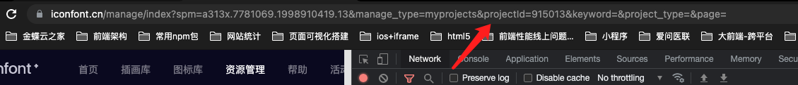
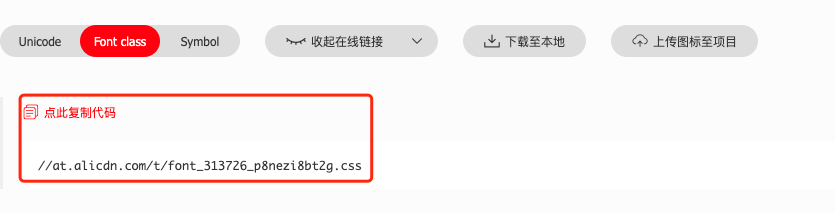

# pull-iconfont-cli

从 iconfont 拉取项目图标文件到本地

### 安装

```
npm i pull-iconfont-cli -D
```
### cli方式使用


#### 使用cdn链接拉取到本地目录

```shell
npx pull-iconfont-cli download https://at.alicdn.com/t/font_313726_0uhevtktz4ld.css -f iconfont.css -d ./src/common/css/UI/font
```


#### 使用账号和密码拉取某个项目的最新的文件到本地

```shell
# 命令格式
pull-iconfont-cli pull <pid> <username> <password> -d [文件下载到的目标路径] -f [文件名]
# 示例
npx pull-iconfont-cli pull 313626 13128732587 yourpassword -f iconfont.css -d ./src/common/css/UI/font
```

### 命令及参数说明

> pull 命令

参数说明
```
npx pull-iconfont-cli pull <pid> <username> <password> -d [文件下载到的目标路径] -f [文件名]
```

> 如何获取 参数pid 即项目id



> 示例

```shell
# 不指定输出目录和文件名
npx pull-iconfont-cli pull 313626 13128732587 yourpassword
# 指定输出目录和文件名
npx pull-iconfont-cli pull 313626 13128732587 yourpassword -f iconfont.css -d ./src/common/css/UI/font
```

> download 命令

参数说明
```
npx pull-iconfont-cli download <font class cdn链接> -d [文件下载到的目标路径] -f [文件名]
```

> 如何获取 font class cdn链接



> 示例

```
npx pull-iconfont-cli download https://at.alicdn.com/t/font_313726_0uhevtktz4ld.css -f iconfont.css -d ./src/common/css/UI/font
```

### 包方式使用
```javascript
const downloadIconfont = require('pull-iconfont-cli')
let downloadUrl = 'https://at.alicdn.com/t/font_313726_0uhevtktz4ld.css'
let fileName = 'iconfont.css'
downloadIconfont({
    url: downloadUrl,
    fileName: fileName,
    dest: './css/icon/fonts'
})
```
### 下载后文件目录结构


```shell
├── font
│   ├── iconfont.css
│   ├── iconfont.eot
│   └── iconfont.woff
```
### 选项说明

|  选项名   | 解释 | 是否必选  | 默认值 |
|  ----  | ---- | ----  |  ----  |
| url   | iconfont中提供的项目在线链接，注意是 font class中的.css结尾的链接哦 | 必选 | 无 |
| fileName | 下载后文件名  | 可选 | iconfont.css |
| dest   | 下载后输出目录 | 可选 | 当前目录下/font文件夹 |

